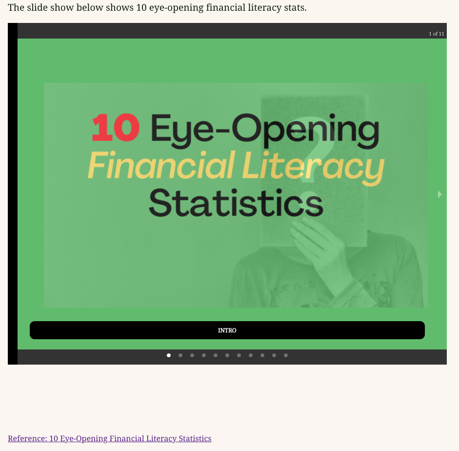
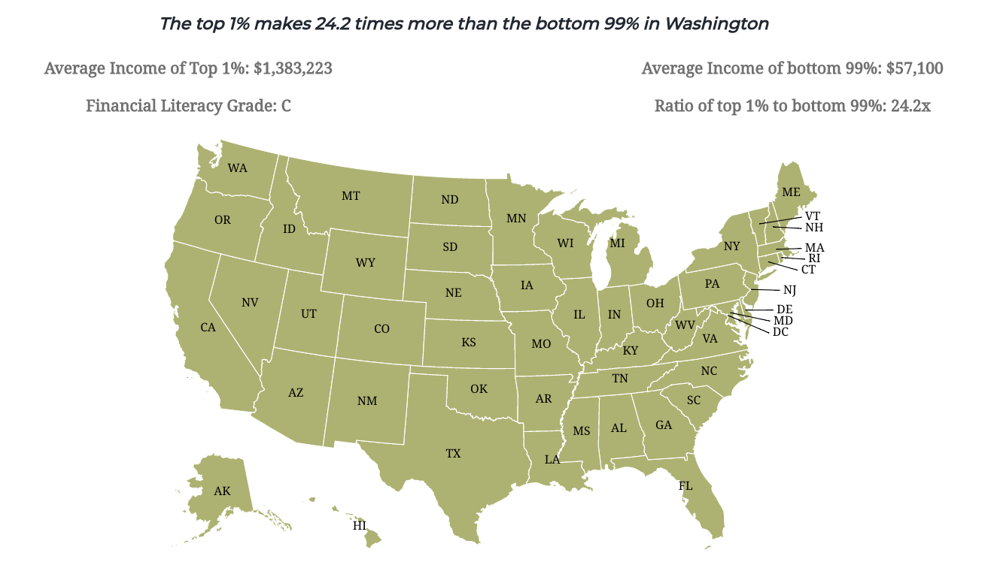
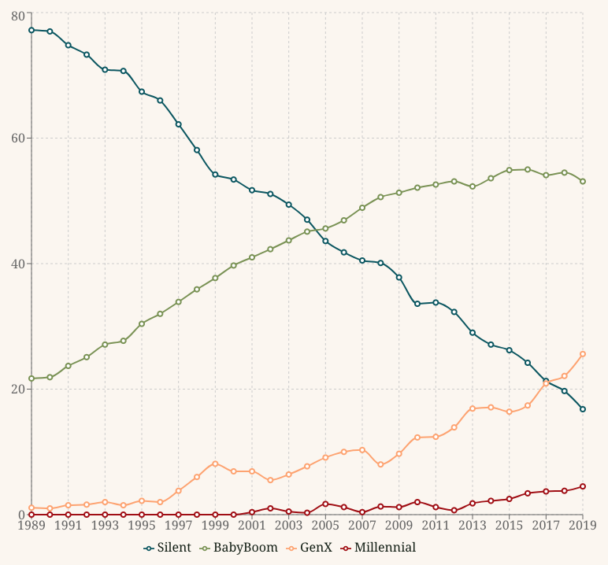
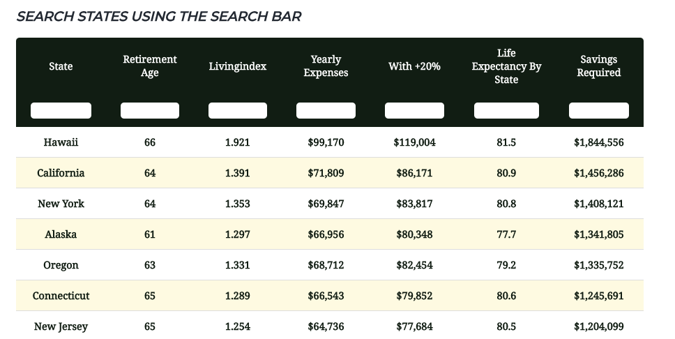
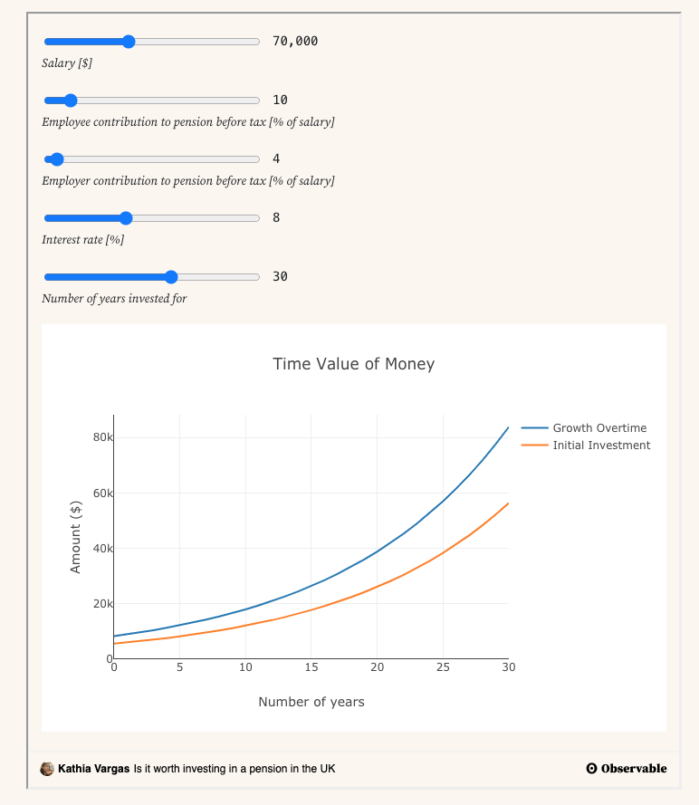

This project was bootstrapped with [Create React App](https://github.com/facebook/create-react-app).

## About

My project is about Wealth and Financial Literacy, Important Fact You Need to Know. I picked this subject because I enjoy learning about personal finance. I have noticed that most millennials around me do not know enough about the subject, and I find this concerning. One of my main discoveries was that in 2019, millennials only owned 4.5% of the wealth in the U.S. On the other hand, baby boomers owned 53.1%. I believe these numbers might get worse over time if financial literacy is not reinforced in future generations from a very early age. 

### Design Decisions 

I had a hard time thinking about how to deliver this message, especially since it is about economics, and I find it can be a little dry to visualize. I started using d3.js to develop the visuals, but then I learned about react.js, and I challenged myself to give it a try. I must say that learning how to use the framework was a big challenge because it was the first time, I interacted with this type of coding structure. After all, I feel it was the best decision. I discovered you can do wonderful things when developing from within a framework such as react.js or vue.js. I must acknowledge that using react.js for this project was a little extra. I believe that, if I would’ve used d3.js instead, I would’ve gotten better results for this purpose. 

One takeaway I learned from taking this approach was that, before making the decision of using any new technology, I need to learn more about the limitations involved when using its components. While it can be advantageous to use them, it can be limiting depending on what you intend to do, and it might end up not being the best fit for your purpose.  

My project made a 360 degrees turn from my initial idea to its current state. First, I wanted to design a financial securities research dashboard, but then I thought, how can this be useful for my audience? After brainstorming and thinking about the objectives of this project. I decided to do something related to financial literacy. 

### I.
In terms of my design choices, that is an aspect of the project I do not feel very proud of. In the first section, I used the react-responsive-carousel component to display the 10 Eye-Opening Financial Literacy Statistics. I recognize this was a weak approach. I totally dislike the choice, but I did not have enough time to use my imagination to come up with a better idea. I feel I could have done better, in the future, I would like to add some sort of sunburst displaying the 10 eye-opening facts in a more interactive way instead.

### II.
The second section is about Income Inequality. I used the react-simple-maps component to render the USA map. This is another disappointment for my expectations because I was not able to come up with the desired outcome. My plan was to build a demographics by state section, and the map was intended to function as the filter. Sadly, my biggest mistake was to use this react component instead of using d3.js. This component might do everything I wanted to do, but it requires time to learn how to use it. Trying to use a color scale on this map was one of the challenges I had. I had it difficult trying different methods with no luck. I’m sure that if I would’ve used d3.js, this would’ve been straightforward from the beginning. Eventually, I got frustrated, abandoned the section, and kept working on other aspects of the project. 

### III.
The third section is about the growing generational wealth gap, in which, I address the issue of wealth inequality by generation. The fact that millennials are in such a disadvantageous position financially is scary, as I mentioned before. To display these scary numbers, I used the library Recharts. I think it was a good choice. It was easy to implement, and I feel the line chart does the work delivering the right message.  

### IV.
The fourth section is about retirement. This is my favorite part of the project. I find it useful to have an estimate of how much savings you might need to retire in a specific state. I have a long way to go to retirement, but I’m already thinking about these important numbers. In terms of design, to build my table I used the react-flexy-table component. The table worked fine, and it was easy to implement. The only disappointment was that I was not able to synchronize it with the map due to its limitations. I did not know which props to use to be able to link these functionalities. Here again another instance in which I think using d3.js would’ve been a better choice. 

### V.
In the last section, I recommend steps to prepare for retirement. My suggestion is that saving early is the key, and to prove my point, I embedded a retirement planning calculator for the readers to estimate how invested money can grow over time. Honesty, I know this is not the only avenue to wealth, but it was a quick suggestion to bring awareness about the importance of saving and investing. In terms of design, I do not like how the embedded chart looks, but I kept it there as a place holder until I come up with a better idea.

## Conclusions

Putting this app together was a beginner’s challenge, and it was very worth it. Now I feel confident knowing that I have a strong foundation, and I am ready to take the next steps to keep developing my skills as a front-end developer.

For others coming into this field, I recommend never taking shorts cuts. I tried taking the easy way out and learned that having strong knowledge of the fundamentals is very important. In this field learning never stops. If you feel you do not want to be constantly learning new technologies this is not for you. If you love figuring things out and exploiting your creativity, this is the right field. I feel this project does not reflect my creative side, but it was more of an exploration of trying new technologies. This can get much better, and it will. Overall, taking the Advance Data Studio class was a life-changing experience. Thanks Prof. Aucher!

### Data Documentation

#### Data Sources: 

* 10 Eye-Opening Financial Literacy Statistics: https://www.opploans.com/oppu/articles/statistics-financial-literacy/

* Income Inequality by State: https://www.epi.org/publication/the-new-gilded-age-income-inequality-in-the-u-s-by-state-metropolitan-area-and-county/

* The Growing Generational Wealth Gap: https://www.washingtonpost.com/business/2019/12/03/precariousness-modern-young-adulthood-one-chart/

* How Much You Need to Retire Comfortably in Each State?: https://howmuch.net/sources/cost-comfortable-retirement-america

* Steps to Prepare for Retirement: https://observablehq.com/@kathiavf16/tvmchart?oetm_referrer=https%3A%2F%2Fkathiavf16.github.io%2F&oetm_route=%2F%40kathiavf16%2Ftvmchart

